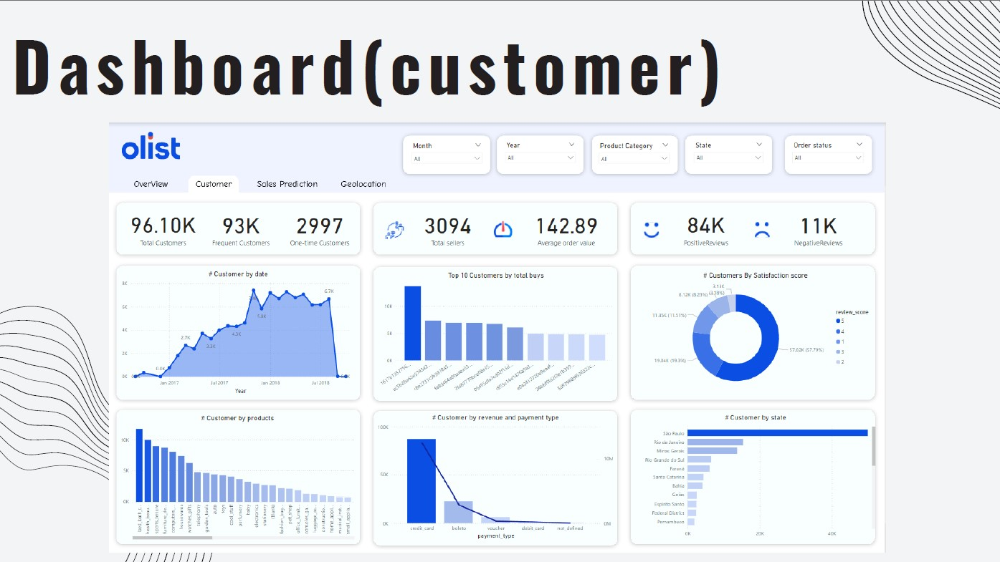
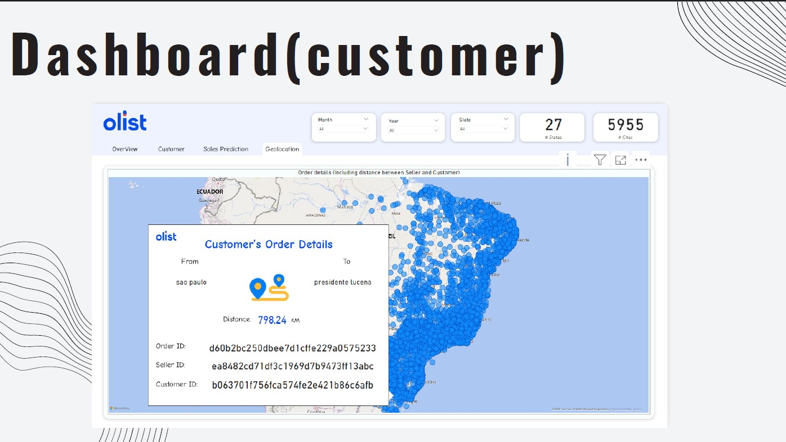
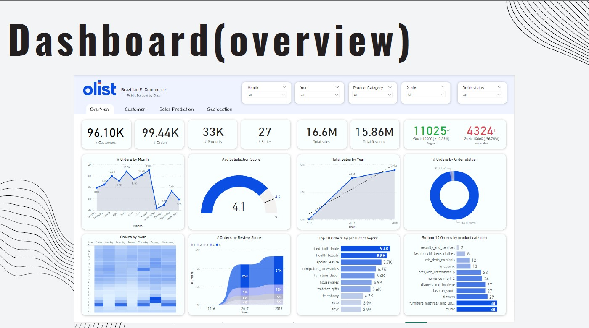
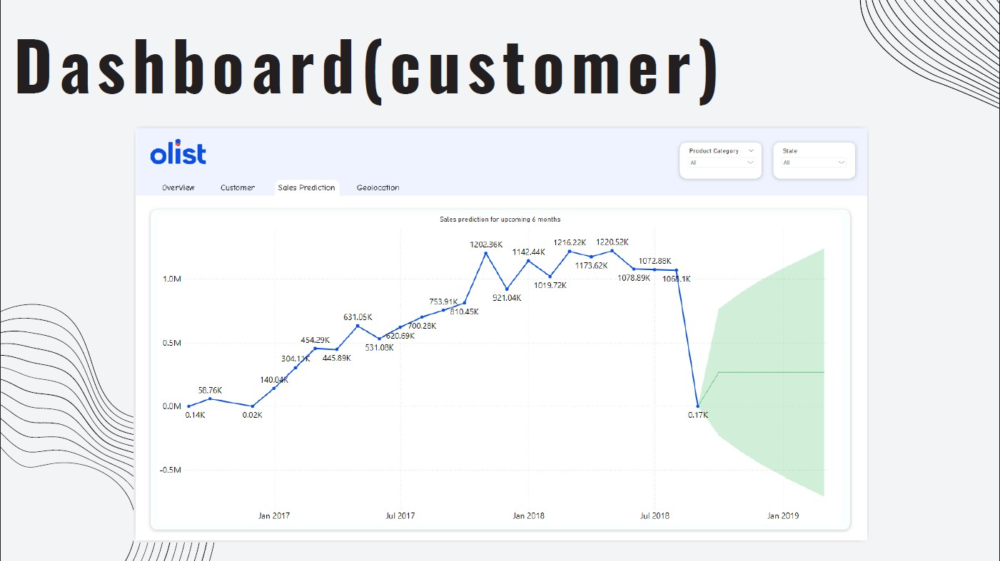

# Brazilian_ECommerce Olist Using PowerBI

a Brazilian e-commerce platform. Each dashboard visualizes data about customer interactions, sales predictions, and geolocation. I'll provide an explanation for each of the dashboards:

1. Overview Dashboard:
Top Metrics: This section provides high-level KPIs:
96.10K Customers: The total number of customers on the platform.
99.44K Orders: Total orders placed.
33K Products: Number of available products.
27 States: Coverage across 27 states.
16.6M Total Sales: Total sales revenue in millions.
15.86M Total Revenue: Revenue after returns or other adjustments.
Goal Achievement (August/September):
In August, the platform surpassed its goal with 11025 orders (102.5% of the goal).
In September, it underperformed, reaching only 4324 orders (56.76% of the goal).
Orders by Month: Shows monthly order trends, with peaks around September and lower activity around December.
Average Satisfaction Score: Displays an average customer satisfaction score of 4.1 out of 5.
Total Sales by Year: Sales have been steadily increasing from 2016 to 2018, showing strong growth.
Orders by Order Status: Breaks down orders by their statuses (e.g., delivered, canceled).
Orders by Review Score: Most orders have a review score of 4 or 5, indicating overall customer satisfaction.
Top 10 Orders by Product Category: Shows the most popular categories, led by bed, bath, table (9.4K orders).
Bottom 10 Orders by Product Category: Shows categories with the least orders, like security services and children's clothes.
Orders by Hour: Heat map shows order activity during the week and time of day. It appears Friday through Monday are busier, especially in the afternoon and evening.
2. Customer Dashboard:
Top Metrics:
96.10K Total Customers: The number of customers that have made purchases.
93K Frequent Customers: Customers who have made repeat purchases.
2997 One-time Customers: The number of customers who made a purchase only once.
3094 Total Sellers: Number of active sellers.
142.89 Average Order Value: The average value of each customer’s order.
84K Positive Reviews: Number of positive reviews received.
11K Negative Reviews: Number of negative reviews received.
Customers by Date: Shows a timeline of when customers made purchases, with peaks around 2018.
Top 10 Customers by Total Buys: A bar chart that ranks customers by the total number of purchases.
Customers by Satisfaction Score: Pie chart showing the distribution of customer satisfaction scores, with most scoring 4 or 5.
Customer by Products: Bar chart showing the number of customers who purchased different products.
Customer by Revenue and Payment Type: Shows revenue generated by different payment methods, with credit card leading.
Customers by State: Displays the distribution of customers across different Brazilian states, with São Paulo having the most.
3. Sales Prediction Dashboard:
Sales Prediction for Upcoming 6 Months: This graph uses historical data to predict future sales performance. Sales had a steady upward trend until around mid-2018, where a significant drop occurred, followed by a prediction of moderate recovery in the following months.
The area in green represents the forecasted data, projecting recovery in the future based on previous trends.
4. Geolocation Dashboard:
Order Details with Distance Between Seller and Customer:
Shows a map of Brazil with customer and seller locations plotted.
The dashboard provides detailed order information, including the distance between São Paulo and Presidente Lucena (798.24 KM) for one specific transaction. This highlights the geographical span of the e-commerce platform, indicating how far products are being shipped.
State and City Metrics:
Displays the number of states (27) and cities (5955) where customers are located, giving a comprehensive overview of the platform’s geographical reach.
